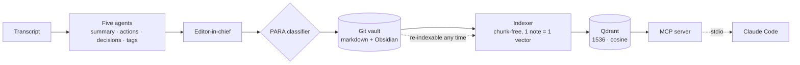

# MindVault

**English** · [Português](README.pt-br.md)


A **self-hosted knowledge vault**: five agents distill a transcript into a note, a classifier
files it under PARA, Git keeps it, Qdrant makes it searchable by meaning, and an **MCP
server** puts the whole thing one question away inside your editor.

Built on **n8n**, **Qdrant** and the **MCP Python SDK** during my AI Data Engineer
specialization — the fourth of a series that also includes a
[multi-store RAG](https://github.com/yagosamu/llamaindex_pydantic_rag), a
[stateful quality agent](https://github.com/yagosamu/quality-guardian-langgraph) and an
[autonomous DataOps crew](https://github.com/yagosamu/sentinel-engine-crewai).

## Why the vault is Git and the index is disposable

Most RAG demos treat the vector store as the system. Here it is a cache.

The notes live as plain markdown in a [Git repository](https://github.com/yagosamu/second-brain-vault),
which Obsidian opens directly. Qdrant holds a derived copy that can be deleted and rebuilt at
any moment by re-running the indexer. That split buys three things:

| | Because the vault is Git | Because the index is derived |
|---|---|---|
| **Durability** | every note has history, diffs and a remote | losing Qdrant costs one re-index, not data |
| **Portability** | markdown opens in any editor, forever | the embedding model can change: re-embed and move on |
| **Honesty** | the source of truth is human-readable | nothing is only reachable through a vector |

Each point's id is derived from the note's path, so re-indexing **upserts** instead of
duplicating. Running the indexer twice over two notes leaves two points, not four.

> **A knowledge vault has to be able to say it does not know.**
> Search without a floor always returns its `limit` nearest rows, however far away they
> are — so a question the vault cannot answer still arrives dressed as evidence. The
> `search_notes` tool takes a `min_score`, and when nothing clears it the answer is an
> explicit "no note scored above 0.45", not an empty result that reads like a failed call.

### The numbers that set the floor

Measured against a two-note vault, with cosine similarity:

```
"por que escolhemos self-host do n8n?"        → 0.405   correct note
"qual a rotina de conciliação financeira?"    → 0.500   correct note
"o que decidimos sobre o Qdrant?"             → 0.527   correct note
"qual a capital da Mongólia?"       min 0.45  → refused
```

A real hit landed at 0.405, so a 0.45 floor would have rejected it. The default is 0.3 for
that reason — the threshold is a dial to calibrate against your own corpus, not a constant
to copy.

## Architecture



The three n8n workflows are independent on purpose: ingestion can run without the index
existing, and the index can be rebuilt without touching ingestion.

### What the MCP server exposes

MCP has three primitives and they answer different questions. **Tools** are model-controlled —
the model decides to call them mid-reasoning. **Resources** are application-controlled, like
opening a file. Search is a decision, so it is a tool; a note has a stable address and no side
effects, so it is also a resource.

| | Signature | Purpose |
|---|---|---|
| **tool** | `search_notes(query, limit=5, min_score=0.3)` | semantic search, returns path + similarity |
| **tool** | `get_note(path)` | one note in full |
| **tool** | `list_notes(folder=None, limit=100)` | browse, optionally by PARA folder |
| **resource** | `note://{+path}` | the same note, addressable by URI |

The server reads **only** from Qdrant. The indexer already copies each note's text into the
payload, so there is no GitHub token here — one fewer secret in circulation.

## What this adds to the reference

The three workflows began as the AIDE workshop reference by
[owshq-mec](https://github.com/owshq-mec/ws-4-n8n-automation). What changed, and why:

| Change | Reason |
|---|---|
| **Self-hosted** n8n + Qdrant via compose | the original needs n8n cloud and a Qdrant cluster; this runs with `make up` |
| `require('crypto')` → pure-JS hash | the Code sandbox blocks builtins unless `NODE_FUNCTION_ALLOW_BUILTIN` is set, and n8n cloud does not expose it — the original workflow cannot run there |
| `Buffer` → `TextDecoder` | standards-based decoding, no dependency on the sandbox's Buffer shim |
| GitHub auth added to the indexer | the reference vault was public, so its reads were anonymous; a private vault answers **404**, not 403, which makes that failure hard to read |
| Qdrant credential removed | self-hosted Qdrant has no API key, and the reference was already inconsistent — its search called Qdrant anonymously while its indexer did not |
| **MCP server** | not in the reference; its README names it as the next step and leaves it out |
| Similarity floor | the reference always returns its three nearest notes, with no way to say "nothing matched" |

## Demo

Asking the vault from inside the editor, over stdio:

```
> o que eu decidi sobre o Qdrant?

search_notes(query="o que decidimos sobre o Qdrant?", limit=1)
  → # 🎙️ Kickoff do Second Brain
    _01 - Projetos/2026-10-03 - kickoff-do-second-brain.md_ · similarity 0.527

    O vault no GitHub é a fonte da verdade; o Qdrant é índice descartável
    e pode ser reconstruído a qualquer momento.
```

And refusing what it does not hold, rather than guessing:

```
search_notes(query="qual a capital da Mongólia?", min_score=0.45)
  → No note in the vault scored above 0.45. Either it was never captured,
    or the threshold is too strict.
```

## Stack

Python 3.11+ · MCP Python SDK 2.3 · httpx · pydantic-settings · n8n 2.42 · Qdrant 1.19 ·
OpenAI embeddings · Docker Compose · pytest · respx · uv

## Run

```bash
cp .env.example .env     # add OPENAI_API_KEY; the rest has working defaults
make up                  # n8n + Qdrant, and the collection they expect
make import              # load the three workflows into n8n
```

Open `http://localhost:5678`, create the local owner account, add the **OpenAI** and
**GitHub API** credentials, then run the workflows in order: `ingest` → `indexer` → `search`.

```bash
make count               # how many notes are indexed
make list                # which workflows n8n currently has
uv run pytest            # 17 tests, no network
```

To reach the vault from an MCP host, copy `.mcp.json.example` to `.mcp.json` and set the
absolute path to this checkout. The host spawns the server over stdio — no port, no daemon.

> **Windows note.** The `Makefile` points `SHELL` at Git Bash and quotes every path. Both are
> needed: GNU Make bypasses `SHELL` for recipes with no shell metacharacters and runs them
> through `CreateProcess`, where `mkdir -p` does not exist and `bash` resolves to the WSL stub.
