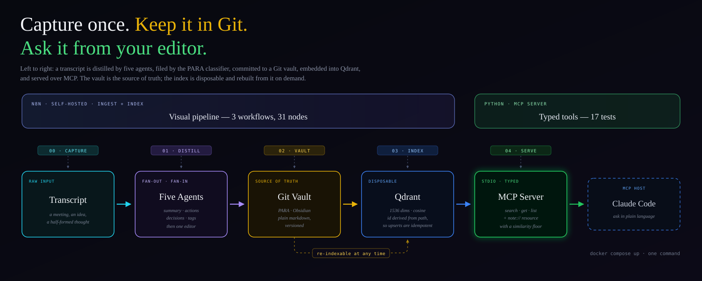
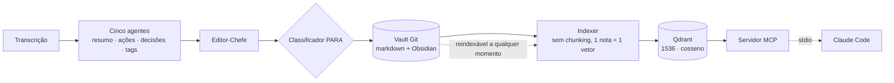

# MindVault

[English](README.md) · **Português**



Um **cofre de conhecimento self-hosted**: cinco agentes destilam uma transcrição em nota, um
classificador arquiva pelo método PARA, o Git guarda, o Qdrant torna pesquisável por
significado, e um **servidor MCP** deixa tudo isso a uma pergunta de distância dentro do seu
editor.

Construído com **n8n**, **Qdrant** e o **SDK Python de MCP** durante minha especialização em
AI Data Engineer — o quarto de uma série que inclui também um
[RAG multi-store](https://github.com/yagosamu/llamaindex_pydantic_rag), um
[agente de qualidade com estado](https://github.com/yagosamu/quality-guardian-langgraph) e um
[time autônomo de DataOps](https://github.com/yagosamu/sentinel-engine-crewai).

## Por que o vault é Git e o índice é descartável

A maioria das demos de RAG trata o banco vetorial como se fosse o sistema. Aqui ele é cache.

As notas vivem como markdown puro num [repositório Git](https://github.com/yagosamu/second-brain-vault),
que o Obsidian abre direto. O Qdrant guarda uma cópia derivada, que pode ser apagada e
reconstruída a qualquer momento rodando o indexer. Essa separação compra três coisas:

| | Porque o vault é Git | Porque o índice é derivado |
|---|---|---|
| **Durabilidade** | toda nota tem histórico, diff e remoto | perder o Qdrant custa uma reindexação, não dados |
| **Portabilidade** | markdown abre em qualquer editor, pra sempre | o modelo de embedding pode mudar: reembeda e segue |
| **Honestidade** | a fonte da verdade é legível por humano | nada fica acessível apenas através de um vetor |

O id de cada ponto é derivado do path da nota, então reindexar faz **upsert** em vez de
duplicar. Rodar o indexer duas vezes sobre duas notas deixa dois pontos, não quatro.

> **Um cofre de conhecimento precisa conseguir dizer que não sabe.**
> Busca sem piso devolve sempre as `limit` linhas mais próximas, por mais distantes que
> estejam — então uma pergunta que o vault não responde chega mesmo assim vestida de
> evidência. A tool `search_notes` recebe um `min_score`, e quando nada passa o retorno é um
> "nenhuma nota passou de 0.45" explícito, não um resultado vazio que parece chamada falha.

### Os números que calibram o piso

Medido contra um vault de duas notas, com similaridade cosseno:

```
"por que escolhemos self-host do n8n?"        → 0.405   nota correta
"qual a rotina de conciliação financeira?"    → 0.500   nota correta
"o que decidimos sobre o Qdrant?"             → 0.527   nota correta
"qual a capital da Mongólia?"       min 0.45  → recusou
```

Um acerto real ficou em 0.405, ou seja, um piso de 0.45 teria rejeitado ele. O default é 0.3
justamente por isso — o limiar é um botão pra calibrar contra o seu corpus, não uma constante
pra copiar.

## Arquitetura



Os três workflows do n8n são independentes de propósito: a ingestão roda sem o índice
existir, e o índice pode ser reconstruído sem tocar na ingestão.

### O que o servidor MCP expõe

MCP tem três primitivas e elas respondem perguntas diferentes. **Tools** são controladas pelo
modelo — ele decide chamar durante o raciocínio. **Resources** são controlados pela aplicação,
como abrir um arquivo. Buscar é uma decisão, então é tool; uma nota tem endereço estável e
nenhum efeito colateral, então também é resource.

| | Assinatura | Para quê |
|---|---|---|
| **tool** | `search_notes(query, limit=5, min_score=0.3)` | busca semântica, devolve path + similaridade |
| **tool** | `get_note(path)` | uma nota por inteiro |
| **tool** | `list_notes(folder=None, limit=100)` | navegar, opcionalmente por pasta PARA |
| **resource** | `note://{+path}` | a mesma nota, endereçável por URI |

O servidor lê **somente** do Qdrant. O indexer já copia o texto da nota pro payload, então não
há token do GitHub aqui — um segredo a menos em circulação.

## O que isto acrescenta à referência

Os três workflows partiram da referência do workshop AIDE por
[owshq-mec](https://github.com/owshq-mec/ws-4-n8n-automation). O que mudou, e por quê:

| Mudança | Motivo |
|---|---|
| **Self-hosted** n8n + Qdrant via compose | o original exige n8n cloud e um cluster Qdrant; este roda com `make up` |
| `require('crypto')` → hash em JS puro | o sandbox do Code bloqueia builtins sem `NODE_FUNCTION_ALLOW_BUILTIN`, e o n8n cloud não expõe essa variável — o workflow original não roda lá |
| `Buffer` → `TextDecoder` | decodificação padrão web, sem depender do shim de Buffer do sandbox |
| Autenticação GitHub no indexer | o vault da referência era público, então as leituras eram anônimas; vault privado responde **404**, não 403, o que torna a falha difícil de ler |
| Credencial Qdrant removida | Qdrant self-hosted não tem API key, e a referência já era inconsistente — o search dela chamava o Qdrant anonimamente e o indexer não |
| **Servidor MCP** | não existe na referência; o README dela aponta como próximo passo e deixa de fora |
| Piso de similaridade | a referência devolve sempre as três notas mais próximas, sem como dizer "nada bateu" |

## Demo

Perguntando ao vault de dentro do editor, por stdio:

```
> o que eu decidi sobre o Qdrant?

search_notes(query="o que decidimos sobre o Qdrant?", limit=1)
  → # 🎙️ Kickoff do Second Brain
    _01 - Projetos/2026-10-03 - kickoff-do-second-brain.md_ · similarity 0.527

    O vault no GitHub é a fonte da verdade; o Qdrant é índice descartável
    e pode ser reconstruído a qualquer momento.
```

E recusando o que não possui, em vez de chutar:

```
search_notes(query="qual a capital da Mongólia?", min_score=0.45)
  → No note in the vault scored above 0.45. Either it was never captured,
    or the threshold is too strict.
```

## Stack

Python 3.11+ · MCP Python SDK 2.3 · httpx · pydantic-settings · n8n 2.42 · Qdrant 1.19 ·
OpenAI embeddings · Docker Compose · pytest · respx · uv

## Executar

```bash
cp .env.example .env     # coloque OPENAI_API_KEY; o resto tem default funcional
make up                  # n8n + Qdrant, e a collection que eles esperam
make import              # carrega os três workflows no n8n
```

Abra `http://localhost:5678`, crie a conta de owner local, adicione as credenciais **OpenAI**
e **GitHub API**, e rode os workflows na ordem: `ingest` → `indexer` → `search`.

```bash
make count               # quantas notas estão indexadas
make list                # quais workflows o n8n tem hoje
uv run pytest            # 17 testes, sem rede
```

Para alcançar o vault a partir de um host MCP, copie `.mcp.json.example` para `.mcp.json` e
ajuste o caminho absoluto deste checkout. O host sobe o servidor por stdio — sem porta, sem
daemon.

> **Nota para Windows.** O `Makefile` aponta `SHELL` para o Git Bash e coloca aspas em todo
> path. As duas coisas são necessárias: o GNU Make ignora o `SHELL` em recipes sem
> metacaracteres e os executa via `CreateProcess`, onde `mkdir -p` não existe e `bash` resolve
> para o stub do WSL.
